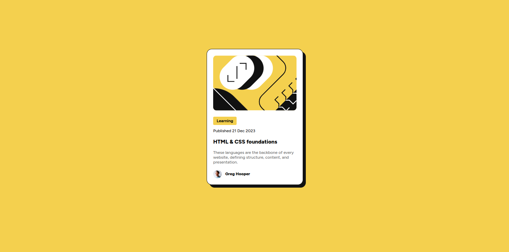

# Frontend Mentor - Blog preview card solution

This is a solution to the [Blog preview card challenge on Frontend Mentor](https://www.frontendmentor.io/challenges/blog-preview-card-ckPaj01IcS). Frontend Mentor challenges help you improve your coding skills by building realistic projects. 

## Table of contents

- [Overview](#overview)
  - [The challenge](#the-challenge)
  - [Screenshot](#screenshot)
  - [Links](#links)
- [My process](#my-process)
  - [Built with](#built-with)
  - [What I learned](#what-i-learned)
  - [Continued development](#continued-development)
- [Author](#author)

## Overview

### The challenge

Users should be able to:

- See hover and focus states for all interactive elements on the page

### Screenshot

### Links

- Solution URL: [code](https://github.com/luisgonzalez2001/fm-blog-preview-card-main)
- Live Site URL: [live site](https://luisgonzalez2001.github.io/fm-blog-preview-card-main/)

## My process

### Built with

- Semantic HTML5 markup
- CSS custom properties
- Flexbox
- Mobile-first workflow

### What I learned

In this project I reviewed some basic knowledge about HTML and CSS, things that I had already learned before but it never hurts to keep practicing.

### Continued development

At the moment I'm just starting out with web development, so I'd like to become more agile when creating content, so I'll keep practicing in general.

## Author

- Github - [@luisgonzalez2001](https://github.com/luisgonzalez2001)
- Frontend Mentor - [@luisgonzalez2001](https://www.frontendmentor.io/profile/luisgonzalez2001)
- LinkedIn - [Luis Gonzalez](www.linkedin.com/in/luis-manuel-gonzalez-rodriguez-5a96681a0)